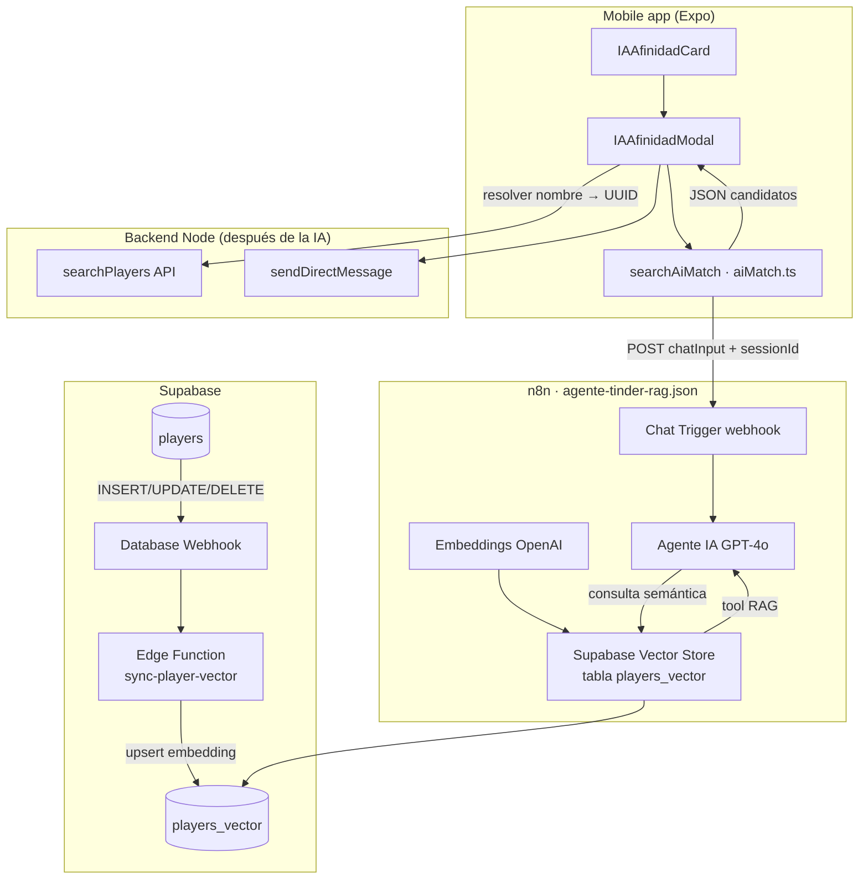

# Flujo IA — Agente Tinder (IA Afinidad)

Documentación simple del matching de jugadores con RAG: **mobile app → n8n → OpenAI + Supabase Vector → respuesta JSON**.

---

## Vista general



---

## 1. Mobile app — IA Afinidad

### Dónde vive

| Pieza | Ruta |
|-------|------|
| Tarjeta en Home | `padel_mono_repo/mobile-app/src/components/home/inicio/IAAfinidadCard.tsx` |
| Modal (formulario + resultados) | `padel_mono_repo/mobile-app/src/components/home/IAAfinidadModal.tsx` |
| Pantalla que orquesta | `padel_mono_repo/mobile-app/src/screens/HomeScreen.tsx` |
| Cliente HTTP a n8n | `padel_mono_repo/mobile-app/src/api/aiMatch.ts` |
| Navegación (chat/perfil desde resultados) | `padel_mono_repo/mobile-app/src/screens/MainApp.tsx` |

### Flujo de usuario

1. En **Inicio**, el usuario pulsa **IA Afinidad** (`IAAfinidadCard`).
2. Si no completó el onboarding de nivelación, se muestra un **hard block** (no se abre la IA).
3. Se abre `IAAfinidadModal`: elige deporte, día, hora y estilo → se arma un texto de solicitud.
4. `HomeScreen.handleAffinitySearch` **enriquece el prompt** con el jugador logueado (ancla):
   - `player_id`, `nombre`, `email`, `elo_rating`, `telefono`
5. Llama a `searchAiMatch(enrichedPrompt)`.
6. La respuesta (texto/JSON) se parsea en el modal (`parseCandidatesFromResponse`).
7. Acciones sobre candidatos:
   - **Mensaje**: `searchPlayers(nombre)` en el backend → `sendDirectMessage`.
   - **Perfil**: mismo `searchPlayers` → abre perfil público por `player_id`.

> La app **no** llama a Supabase para el matching. Solo habla con el **webhook de n8n**.

### Variable de entorno

En `mobile-app/.env`:

```env
EXPO_PUBLIC_AI_MATCH_WEBHOOK_URL=https://<host-n8n>/webhook/<webhook-id>/chat
```

El `webhook-id` del workflow exportado es `36c6520e-6891-4251-8b7f-cad0f6e02f67` (nodo **When chat message received** en `agente-tinder-rag.json`).

### Request que envía la app

```http
POST {EXPO_PUBLIC_AI_MATCH_WEBHOOK_URL}?sessionId={sessionId}
Content-Type: application/json

{
  "action": "sendMessage",
  "sessionId": "mobile-...",
  "chatInput": "<prompt enriquecido con ancla + solicitud>"
}
```

- `sessionId` se guarda en `AsyncStorage` (`ai_match_session_id`) para mantener conversación en n8n.
- La respuesta puede venir como JSON puro, texto, o JSON anidado en `output` / `response`; `aiMatch.ts` normaliza eso.

### Formato esperado de respuesta (IA)

El agente está instruido para devolver **solo JSON**:

```json
{
  "summary": "string",
  "candidates": [
    {
      "name": "string",
      "matchPercent": 0,
      "level": "string",
      "matches": 0,
      "wins": "string",
      "distance": "string",
      "tags": ["string"],
      "reason": "string"
    }
  ]
}
```

El modal tolera variantes (`jugadores`, `players`) y, si falla el JSON, intenta extraer nombres del texto libre.

---

## 2. n8n — `agente-tinder-rag.json`

Workflow mínimo de **4 nodos** conectados:

| Nodo | Rol |
|------|-----|
| **When chat message received** | Webhook público; recibe `chatInput` y metadata de sesión. |
| **Agente IA** | LangChain Agent (GPT-4o) con system prompt de *Arkia Match Pádel*. |
| **Supabase Vector Store** | Herramienta RAG: tabla `players_vector`, `topK: 40`, modo `retrieve-as-tool`. |
| **Embeddings OpenAI** | `text-embedding-3-small` (implícito en el nodo estándar de n8n). |
| **OpenAI** | Modelo de chat `gpt-4o`. |

### Qué hace el agente

1. Recibe el mensaje (incluye contexto del jugador ancla inyectado por la app).
2. **Invoca la herramienta** de vector store para recuperar perfiles similares.
3. Aplica reglas de scoring (nivel, disponibilidad, distancia, etc.) en el prompt.
4. Devuelve JSON con 2–3 candidatos (o parciales ordenados por `matchPercent`).
5. `enableStreaming: true` — la app hoy consume la respuesta como texto completo al finalizar.

### Importar / desplegar

1. En n8n: **Import workflow** → `N8N/agente-tinder/agente-tinder-rag.json`.
2. Revisar credenciales: **OpenAI** y **Supabase** (cuenta que apunta al proyecto correcto).
3. Activar el workflow y copiar la URL del **Chat Trigger** a `EXPO_PUBLIC_AI_MATCH_WEBHOOK_URL`.

---

## 3. Supabase — datos vectoriales

### Tablas

| Tabla | Uso |
|-------|-----|
| `public.players` | Fuente de verdad del perfil (nombre, ELO, teléfono, preferencias, etc.). |
| `public.players_vector` | Filas con `content` (texto para RAG), `embedding` (vector), `metadata`, `player_id`. |

La migración en repo añade el vínculo estable jugador ↔ vector:

- `N8N/agente-tinder/supabase/migrations/20250325120000_players_vector_player_id.sql`
- Fix índice único: `supabase/fix-players-vector-unique-player-id.sql`

Columna clave: **`player_id`** (UUID → `players.id`) con índice único para `upsert` desde la Edge Function.

### RPC `match_documents` (búsqueda vectorial)

Es la función que invoca el nodo **Supabase Vector Store** de n8n cuando el agente usa la herramienta RAG. La app móvil y el backend **no** llaman a esta RPC directamente.

| Parámetro | Tipo | Uso |
|-----------|------|-----|
| `query_embedding` | `vector` | Embedding de la consulta (OpenAI en n8n). |
| `match_count` | `integer` | Máximo de filas (en el workflow: `topK: 40`). |
| `filter` | `jsonb` | Filtro opcional sobre `metadata` (`metadata @> filter`). |

**Definición** (schema `public`):

```sql
select
  id,
  content,
  metadata,
  1 - (embedding <=> query_embedding) as similarity
from public.players_vector
where metadata @> filter
order by embedding <=> query_embedding
limit match_count;
```

- `<=>` es distancia coseno en **pgvector** (menor = más parecido).
- `similarity` = `1 - distancia` (mayor = más parecido).
- Devuelve `id`, `content`, `metadata` de cada jugador candidato para que GPT-4o rankee y arme el JSON.

SQL versionado en repo: `supabase/migrations/match_documents_rpc.sql`.

**Cadena en tiempo de consulta:**

1. Usuario escribe en la app → n8n recibe `chatInput`.
2. n8n embede el texto (nodo **Embeddings OpenAI**).
3. n8n llama `rpc('match_documents', { query_embedding, match_count, filter })`.
4. El agente lee los `content` recuperados y responde con `candidates[]`.

### Edge Function: `sync-player-vector`

Mantiene `players_vector` al día cuando cambia un jugador.

| Copia en repo | Notas |
|---------------|--------|
| `N8N/agente-tinder/supabase/functions/sync-player-vector/` | Versión completa: webhook secret, DELETE, `buildContent` selectivo. |
| `padel_mono_repo/supabase/functions/sync-player-vector/` | Versión desplegada en el mono-repo; `buildContent` serializa todas las columnas del player. |

**Flujo:**

1. Cambio en `players` (INSERT/UPDATE/DELETE) → **Database Webhook** de Supabase.
2. POST a `https://<project>.supabase.co/functions/v1/sync-player-vector` con header `x-webhook-secret`.
3. La función lee el jugador, genera texto (`content`), pide embedding a OpenAI (`text-embedding-3-small`), hace **upsert** en `players_vector` por `player_id`.
4. En DELETE, borra la fila vectorial.

Secrets: `OPENAI_API_KEY`, `WEBHOOK_SECRET` (recomendado). Ver despliegue en `N8N/agente-tinder/supabase/README.md`.

**Prueba manual:**

```bash
curl -X POST "https://<PROJECT_REF>.supabase.co/functions/v1/sync-player-vector" \
  -H "Content-Type: application/json" \
  -H "x-webhook-secret: <WEBHOOK_SECRET>" \
  -d '{"player_id":"<uuid>"}'
```

### Ingesta inicial / demo

`N8N/agente-tinder/ingest-player.js` — script Node para insertar jugadores de prueba en `players_vector` (genera embeddings e inserta por REST). Útil en desarrollo; en producción el camino normal es **players + webhook + Edge Function**.

---

## 4. Cadena completa (ejemplo)

1. **Registro/actualización** de un jugador en la app → fila en `players`.
2. **Webhook** dispara `sync-player-vector` → fila en `players_vector` con embedding.
3. Usuario abre **IA Afinidad**, elige “Pádel · Mañana · Tarde · Competitivo”.
4. App envía prompt con su `player_id` y ELO como ancla.
5. **n8n** embede la consulta, busca en `players_vector`, **GPT-4o** rankea y responde JSON.
6. Modal muestra candidatos; al pulsar “Mensaje”, **backend** resuelve el nombre a un `player_id` real y abre el chat.

---

## 5. Archivos de referencia rápida

```
N8N/agente-tinder/
├── agente-tinder-rag.json          # Workflow n8n (importar)
├── FLUJO-IA.md                     # Este documento
├── ingest-player.js                # Seed manual de vectores
└── supabase/
    ├── README.md                   # Deploy Edge Function + webhook
    ├── migrations/...              # player_id en players_vector
    └── functions/sync-player-vector/

padel_mono_repo/mobile-app/
├── src/api/aiMatch.ts
├── src/screens/HomeScreen.tsx
└── src/components/home/IAAfinidadModal.tsx
```

---

## 6. Troubleshooting breve

| Síntoma | Revisar |
|---------|---------|
| “Falta EXPO_PUBLIC_AI_MATCH_WEBHOOK_URL” | `.env` de mobile-app y rebuild Expo. |
| “Servicio de IA no disponible” | Workflow n8n activo; URL del webhook correcta. |
| Candidatos vacíos o inventados | ¿Hay filas en `players_vector`? ¿Webhook y Edge Function OK? |
| Upsert falla en Edge Function | ¿Migración `player_id` + índice único aplicada? |
| No encuentra jugador al enviar DM | La IA devuelve **nombre**; la app busca por texto en API `searchPlayers` (no usa `player_id` del JSON hoy). |
| IA bloqueada en Home | `onboardingCompleted === false` en el perfil del jugador. |

---

## 7. Relación con otros flujos

- **`AiMatchModal.tsx`**: UI similar para matchmaking; en el repo actual **no** está cableada al Home (solo **IA Afinidad** usa `searchAiMatch`).
- **RPC `player_matchmaking_record`** (backend): lógica de matchmaking clásica, **independiente** de este agente RAG.
- **WeChat** (`padel_mono_repo/wechat/api/aiMatch.js`): mismo patrón webhook que la app Expo.
