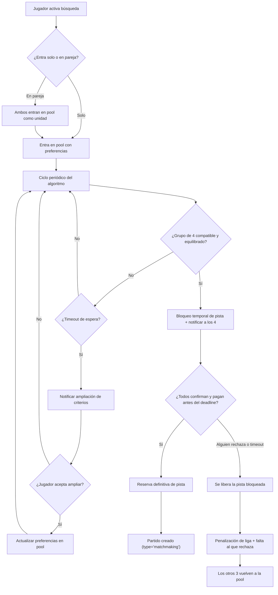
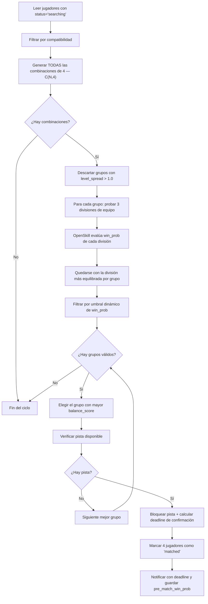
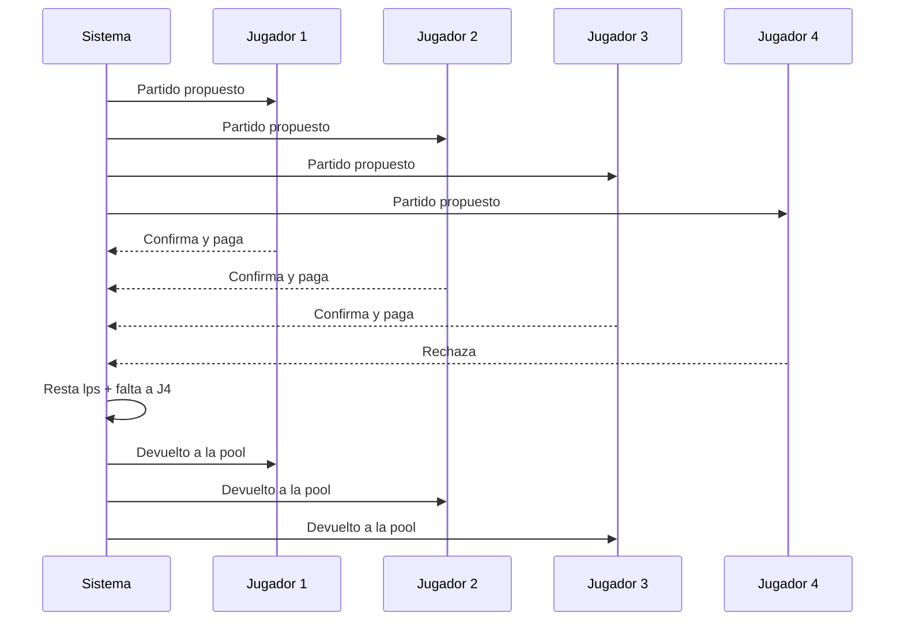

# 06 — Algoritmo de matchmaking

> Este algoritmo **solo aplica a partidos de tipo `matchmaking`** (ligas). Los partidos abiertos tienen su propia lógica de filtro de nivel (ver sección 7).

---

## Resumen ejecutivo

### ¿Qué es?

Un sistema que permite a un jugador (solo o en pareja) activar la búsqueda de partido desde la app. El sistema encuentra automáticamente 4 jugadores compatibles, propone la combinación de equipos más equilibrada, y reserva pista cuando todos confirman y pagan.

### ¿Cómo funciona en 6 pasos?

1. **El jugador entra en la pool** con sus preferencias (horario, club/distancia, lado, género).
2. **Un ciclo periódico** genera **todas las combinaciones posibles** de 4 jugadores compatibles de la pool.
3. **Se filtra por nivel**: se descartan grupos donde la diferencia de nivel supera el máximo permitido.
4. **Para cada grupo válido, se prueban las 3 formas de dividirlos en 2 equipos**. OpenSkill predice la probabilidad de victoria de cada división. Se elige la combinación de grupo + división más equilibrada (más cercana a 50/50).
5. **Se notifica a los 4 jugadores**. Si todos confirman y pagan → reserva automática de pista. Si alguien rechaza (o no paga a tiempo) → penalización de liga (lps) y falta para quien rechaza; los otros 3 vuelven a la pool.
6. **Se crea el partido** con `type = 'matchmaking'` y `competitive = true`.

### Principios de diseño

- **Equilibrio sobre velocidad**: es preferible esperar más y encontrar un partido justo que proponer uno mediocre rápido.
- **Parejas indivisibles**: si dos jugadores entran juntos, el sistema los trata como unidad.
- **Transparencia en la ampliación**: el sistema nunca relaja criterios sin confirmación explícita del jugador.
- **Consecuencia directa al rechazo**: rechazar un partido propuesto penaliza en liga (lps) y acumula faltas con penalización escalable.

---

## 1. Flujo general



---

## 2. Estado actual

**Archivo:** `backend/src/routes/matches.ts`

La tabla `matches` tiene `elo_min`, `elo_max` y `gender` para filtrar en partidos abiertos. La función `hasCourtConflict` (línea 17–74) verifica conflictos de horario y puede reutilizarse.

**No existe:**
- Ninguna tabla de pool de matchmaking
- Ningún algoritmo de emparejamiento
- Ninguna ruta para activar/desactivar la búsqueda
- Ninguna lógica de reserva automática
- El campo `type` en `matches` (ver componente 02)

---

## 3. Qué hay que cambiar

### 3.1 `backend/src/routes/matches.ts`
La función `hasCourtConflict` (línea 17–74) debe extraerse a `backend/src/services/bookingService.ts` para que el matchmaking también pueda verificar conflictos de horario antes de proponer una pista.

---

## 4. Qué hay que crear nuevo

### 4.1 Tabla `matchmaking_pool` en Supabase

```
matchmaking_pool
├── id               uuid PRIMARY KEY default gen_random_uuid()
├── player_id        uuid NOT NULL UNIQUE references players(id)
├── paired_with_id   uuid references players(id)              ← null si entra solo
├── club_id          uuid references clubs(id)                ← nullable; preferencia de club
├── max_distance_km  int4                                     ← nullable; radio si no hay club
├── preferred_side   text                                     ← 'drive' | 'backhand' | 'any'
├── gender           text NOT NULL default 'any'              ← 'male' | 'female' | 'mixed' | 'any'
├── available_from   timestamptz NOT NULL                     ← MVP: un solo intervalo
├── available_until  timestamptz NOT NULL                     ← MVP: un solo intervalo
├── status           text NOT NULL default 'searching'        ← 'searching' | 'matched' | 'expired'
├── created_at       timestamptz default now()
└── expires_at       timestamptz                              ← pendiente de definir
```

`player_id` es UNIQUE — un jugador solo puede estar en la pool una vez.

Si `paired_with_id` está presente, ambos jugadores deben estar en la pool para que el sistema los considere disponibles para un partido.

**MVP:** El jugador especifica un solo intervalo de disponibilidad (`available_from` → `available_until`). En versiones futuras se permitirán múltiples franjas horarias (ej. 10:00-12:00 y 18:00-20:00).

#### Entrada en pareja

Cuando `paired_with_id` no es null:
- Ambos jugadores deben estar en la pool para que el sistema los considere.
- Se tratan como unidad indivisible: el algoritmo solo busca 2 rivales.
- Solo hay 1 combinación de equipos posible (la pareja vinculada va junta).

### 4.2 Nuevas rutas de matchmaking

Archivo nuevo: `backend/src/routes/matchmaking.ts`, registrado en `backend/src/routes/index.ts`.

---

#### `POST /matchmaking/join`

Añade al jugador a la pool de búsqueda.

**Validaciones:**
1. `initial_rating_completed = true` (debe tener nivel asignado via cuestionario)
2. El jugador no está ya en la pool (409 si está)
3. Si `paired_with_id` presente: verificar que ese jugador existe (no se requiere que ya esté en pool)

**Body:**
```json
{
  "club_id": "uuid-del-club",
  "max_distance_km": 10,
  "preferred_side": "drive",        // 'drive' | 'backhand' | 'any'
  "gender": "any",                  // 'male' | 'female' | 'mixed' | 'any'
  "available_from": "2026-03-25T18:00:00Z",
  "available_until": "2026-03-25T21:00:00Z",
  "paired_with_id": null            // uuid si entra en pareja, null si entra solo
}
```

**Lógica:**
1. Verificar que `initial_rating_completed = true` (debe tener nivel asignado)
2. Verificar que el jugador no está ya en la pool (409 si está)
3. Si `paired_with_id` presente: verificar que ese jugador existe (no se requiere que ya esté en pool)
4. Insertar en `matchmaking_pool`
5. Responder 200

---

#### `DELETE /matchmaking/leave`
Marca el registro del jugador como `expired` o lo elimina. Salida voluntaria.

---

#### `GET /matchmaking/status`
```json
{
  "ok": true,
  "status": "searching",       // 'searching' | 'matched' | 'not_in_pool'
  "match_id": null
}
```

Cuando `status = 'matched'`, incluye `match_id` del partido creado.

---

### 4.3 Endpoint de estadísticas del jugador

**Archivo:** `backend/src/routes/players.ts` o archivo nuevo `backend/src/routes/playerStats.ts`

```
GET /players/:id/stats
```

El frontend solo renderiza — no calcula estadísticas en cliente.

**Respuesta:**
```json
{
  "ok": true,
  "win_streak": 3,
  "loss_streak": 0,
  "win_rate_last_20": 0.65,
  "matches_played_competitive": 42,
  "matches_played_friendly": 15,
  "matches_played_matchmaking": 28
}
```

---

### 4.4 Restricción de nivel en partidos abiertos

**Partidos abiertos competitivos** (`competitive = true`):
- Al crear el partido, el backend calcula automáticamente `elo_min = creator_elo - 0.5` y `elo_max = creator_elo + 0.5`
- Los campos `elo_min` y `elo_max` que ya existen en la tabla `matches` se usan para esta validación
- El creador **no puede** modificar este rango manualmente
- Al intentar unirse (`POST /matches/:id/prepare-join`), el backend verifica que el `elo_rating` del jugador está dentro del rango
- Cualquier jugador dentro del rango puede ocupar cualquiera de las 3 posiciones libres

**Partidos abiertos amistosos** (`competitive = false`):
- El creador elige el rango de nivel libremente (o sin restricción)
- No afectan mu/sigma/elo_rating

---

### 4.5 ¿Qué es OpenSkill y qué papel juega?

**OpenSkill** es una librería de rating (modelo Plackett-Luce) que hace dos cosas:

1. **Predecir** quién gana: dada una combinación de equipos, calcula la probabilidad de victoria de cada equipo (`predictWinProbability`). Para esto usa las variables internas de cada jugador:
   - `mu` — estimación de habilidad real
   - `sigma` — incertidumbre sobre esa estimación
   - `beta` — variabilidad/inconsistencia del jugador (no es penalización sobre mu; es varianza adicional en la predicción)

2. **Actualizar ratings** tras un partido: ajusta mu y sigma de cada jugador según el resultado. Esto lo hace el pipeline de nivelación (componente 03), no el matchmaking.

**En el matchmaking, solo se usa la función de predicción** (punto 1). El algoritmo genera combinaciones de jugadores y equipos, y OpenSkill evalúa cada una para determinar cuál es la más equilibrada.

> **Nota sobre beta en OpenSkill:** Beta no es una penalización directa sobre mu. Es varianza adicional en la predicción. OpenSkill ya la incorpora en la varianza combinada del equipo al calcular `predictWinProbability`. No hay que restar `beta` a `mu` manualmente.

---

### 4.6 Servicio de matchmaking `backend/src/services/matchmakingService.ts`

#### Función principal: `runMatchmakingCycle()`

Se ejecuta periódicamente. El proceso es **exhaustivo**: genera todas las combinaciones posibles y elige la mejor.

##### Proceso paso a paso

1. **Leer pool**: todos los jugadores con `status = 'searching'`.
2. **Filtrar por compatibilidad**: liga (preferente, con ampliación automática a adyacentes), género, horario superpuesto, club/distancia (ver filtros abajo).
3. **Manejar entradas en pareja**: si `paired_with_id != null`, buscar su pareja en la pool. Si la pareja no está: skip. Si los dos están: tratarlos como unidad.
4. **Generar todas las combinaciones de 4 jugadores** a partir de los jugadores compatibles entre sí. Si hay N jugadores compatibles, se generan C(N, 4) grupos posibles.
5. **Para cada grupo de 4**:
   a. Aplicar filtro `max_level_spread` (descartar si spread > 1.0)
   b. Calcular `bestTeamSplit` (probar las 3 divisiones de equipo posibles)
   c. OpenSkill evalúa `win_prob` de cada división via `predictWinProbability`
   d. Quedarse con la división más equilibrada (mayor `balance_score`)
   e. Aplicar umbral dinámico de `win_prob` según tamaño de pool
   f. Ajustar rango según evolución reciente del jugador
6. **De todos los grupos válidos**: elegir el de mayor `balance_score` (más cercano a 50/50).
7. **Verificar disponibilidad de pista** en el club/zona compatible (reutilizar `hasCourtConflict` de `bookingService`). Si no hay pista: intentar siguiente mejor grupo.
8. **Si partido válido encontrado**:
   - **Bloquear pista temporalmente** (no reserva definitiva — se libera si alguien rechaza o se agota el tiempo)
   - Calcular deadline de confirmación: `min(tiempo_hasta_partido × 0.5, 24h)`, mínimo 30 min
   - Marcar los 4 jugadores como `status='matched'`
   - Notificar a los 4 (push notification) con el deadline
   - Guardar `pre_match_win_prob` (se muestra al jugador desde la confirmación, antes de jugar)

##### Ejemplo con 8 jugadores en pool

```
8 jugadores compatibles → C(8,4) = 70 grupos posibles de 4
  → 70 grupos pasan por filtro de nivel → quedan 45 (por ejemplo)
  → 45 grupos × 3 divisiones de equipo = 135 combinaciones evaluadas por OpenSkill
  → De cada grupo se queda la mejor división → 45 candidatos con su balance_score
  → Se filtran por umbral de win_prob → quedan 20
  → Se elige el de mayor balance_score → GANADOR
  → Se verifica pista → OK → Partido propuesto
```

##### Pseudocódigo

```typescript
async function runMatchmakingCycle(): Promise<void> {
  // 1. Leer jugadores con status='searching' en matchmaking_pool
  //    - Incluir mu, sigma, beta, preferred_side, gender, available_from/until, paired_with_id

  // 2. Filtrar por compatibilidad de preferencias:
  //    a. Filtrar por liga (misma liga preferente; si no hay suficientes tras espera, ampliar a adyacentes automáticamente)
  //    b. Filtrar por género (ver tabla de compatibilidad; 'mixed' exige 2H+2M con 1+1 por equipo)
  //    c. Filtrar por horario superpuesto
  //    d. Filtrar por club/distancia

  // 3. Manejar entradas en pareja:
  //    - Si player.paired_with_id != null, buscar su pareja en la pool
  //    - Si la pareja no está en pool: skip (esperan juntos)
  //    - Si los dos están: tratarlos como unidad; buscar 2 rivales compatibles

  // 4. Generar TODAS las combinaciones de 4 jugadores compatibles — C(N,4)

  // 5. Para CADA grupo de 4:
  //    a. Aplicar filtro max_level_spread (descartar si spread > 1.0)
  //    b. Calcular bestTeamSplit (probar las 3 divisiones de equipo posibles)
  //    c. OpenSkill evalúa win_prob de cada división via predictWinProbability
  //    d. Quedarse con la división más equilibrada (mayor balance_score)
  //    e. Aplicar umbral de win_prob [0.35, 0.65]
  //    f. Ajustar rango según evolución reciente del jugador

  // 6. De todos los grupos válidos: elegir el de mayor balance_score

  // 7. Verificar disponibilidad de pista en el club/zona compatible
  //    (reutilizar hasCourtConflict de bookingService)
  //    Si no hay pista: intentar siguiente mejor grupo

  // 8. Si partido válido encontrado:
  //    - Bloquear pista temporalmente (no reserva definitiva)
  //    - Calcular deadline: min(tiempo_hasta_partido × 0.5, 24h), mínimo 30 min
  //    - Marcar los 4 jugadores como status='matched'
  //    - Notificar a los 4 (push notification) con el deadline
  //    - Guardar pre_match_win_prob (se muestra al jugador desde la confirmación, antes de jugar)
}
```



#### Filtros de compatibilidad

**Género** — Filtro estricto. Compatibilidad entre preferencias de dos jugadores:

| Jugador A \ B | `male` | `female` | `mixed` | `any` |
|---|---|---|---|---|
| `male` | ✅ | ❌ | ❌ | ✅ |
| `female` | ❌ | ✅ | ❌ | ✅ |
| `mixed` | ❌ | ❌ | ✅ | ✅ |
| `any` | ✅ | ✅ | ✅ | ✅ |

- `'male'`: solo partidos entre hombres.
- `'female'`: solo partidos entre mujeres.
- `'mixed'`: obligatoriamente 1 hombre + 1 mujer por equipo (2H + 2M en total). Requiere conocer el género real del jugador (campo `gender` en tabla `players`).
- `'any'`: sin restricción de composición — cualquier combinación de géneros es válida.

> **Dependencia:** El filtro `'mixed'` requiere que la tabla `players` tenga un campo `gender` (`'male'` | `'female'`) que indique el género real del jugador. Este campo es distinto de la preferencia de género en la pool (que indica qué tipo de partido busca).

**Horario** — Los intervalos `[available_from, available_until]` de los 4 jugadores deben solaparse lo suficiente para jugar un partido.

**Club/Distancia** — El partido debe ser en un club compatible con las preferencias de los 4 jugadores (mismo club, o dentro del `max_distance_km` de cada uno).

**Liga** — Filtro preferente con ampliación automática:

- El sistema busca primero los 4 jugadores en la **misma liga**.
- Si tras el tiempo de espera no hay suficientes jugadores compatibles en la misma liga, se amplía **automáticamente** a ligas adyacentes (ej. bronce puede matchear con plata). Esta ampliación **no requiere confirmación del jugador**, a diferencia del resto de criterios.
- **Nunca se salta más de una liga de distancia** (bronce no matchea con oro).
- En partidos entre ligas distintas (cross-liga), los LP se ajustan:
  - Jugador de liga inferior gana → más LP de lo normal
  - Jugador de liga superior pierde → pierde más LP de lo normal
  - (Valores exactos pendientes — se definirán en el componente de ligas)

> **Justificación de la ampliación automática:** Fragmentar la pool por liga con pocos usuarios es más dañino para la experiencia que emparejar entre ligas adyacentes. El ajuste de LP en partidos cross-liga compensa la diferencia competitiva. El jugador de liga inferior tiene incentivo extra (más LP si gana) y el de liga superior asume riesgo extra (más LP si pierde).

> **Nota:** La definición de ligas, rangos de LP para ascenso/descenso, y cálculo exacto del ajuste cross-liga se documenta en un componente separado (pendiente de crear).

#### Filtro `max_level_spread` (decisión tomada)

```
MAX_LEVEL_SPREAD = 1.0  (escala elo_rating 0–7)
```

Se descartan grupos donde la diferencia entre el elo más alto y el más bajo supera 1.0 puntos. No es válido juntar jugadores de nivel muy diferente aunque la media de los equipos sea similar — el equilibrio de equipo no garantiza experiencia justa individual.

```typescript
const MAX_LEVEL_SPREAD = 1.0; // decisión tomada — escala 0–7

function exceedsLevelSpread(players: Player[]): boolean {
  const eloValues = players.map(p => p.elo_rating);
  return Math.max(...eloValues) - Math.min(...eloValues) > MAX_LEVEL_SPREAD;
}
```

#### Sub-función: `bestTeamSplit`

Para 4 jugadores sin pareja vinculada, existen 3 combinaciones posibles de equipos:

| Combinación | Equipo A | Equipo B |
|---|---|---|
| 1 | [J0, J1] | [J2, J3] |
| 2 | [J0, J2] | [J1, J3] |
| 3 | [J0, J3] | [J1, J2] |

Para cada combinación se calcula:

1. **Sinergía** de cada pareja (vía tabla `player_synergies`; 0 si no hay historial).
2. **Probabilidad de victoria** → se llama a `OpenSkill.predictWinProbability([equipoA], [equipoB])`. OpenSkill toma los `mu`, `sigma` y `beta` de los 4 jugadores y devuelve un número entre 0 y 1 (ej. 0.55 = equipo A gana el 55% de las veces).
3. **Puntuación de equilibrio**: `balance_score = 1 - |win_prob - 0.5| × 2`. Cuanto más cerca de 0.50 la win_prob, mayor el balance_score (máximo = 1.0 si es exactamente 50/50).

Se elige la combinación con mayor `balance_score` (la más cercana a 50/50).

```typescript
function bestTeamSplit(players: [Player, Player, Player, Player]): {
  teamA: [Player, Player];
  teamB: [Player, Player];
  winProbability: number;
} {
  const combinations = [
    [[0,1],[2,3]],
    [[0,2],[1,3]],
    [[0,3],[1,2]],
  ];

  // Para cada combinación:
  // 1. Obtener sinergía de cada pareja (getSynergy)
  // 2. Calcular win_prob usando predictWinProbability de OpenSkill
  //    → OpenSkill incorpora mu, sigma y beta en la varianza combinada
  //    → NO restar beta directamente a mu (beta no es una penalización sobre mu)
  // 3. balance_score = 1 - |win_prob - 0.5| * 2
  // 4. Devolver la combinación con mayor balance_score

  // Nota sobre sinergía en partidos de parejas vinculadas (paired_with_id):
  // Si los dos jugadores entraron juntos, la sinergía ya viene dada.
  // En ese caso, la función solo evalúa las combinaciones de rivales posibles (1 combinación).
}
```

**Caso de pareja vinculada:** Si los 4 jugadores incluyen una pareja con `paired_with_id`, esa pareja va junta obligatoriamente. Solo se evalúa 1 combinación.

#### Sub-función: `getSynergy`

```typescript
async function getSynergy(id1: string, id2: string): Promise<number> {
  const [a, b] = id1 < id2 ? [id1, id2] : [id2, id1];
  // Buscar en player_synergies; si no existe, devolver 0
}
```

#### Sinergía entre jugadores

La sinergía mide cuánto rinden dos jugadores cuando juegan juntos como pareja. Se almacena en la tabla `player_synergies` (con `player_id_1 < player_id_2` para evitar duplicados).

**Cómo se actualiza (tras cada partido juntos):**
- Jugar juntos **sube** la sinergía una cantidad base.
- **Ganar** sube una cantidad extra (proporcional al margen de victoria).
- **Perder** baja una cantidad extra (proporcional al margen de derrota).

**Cómo se usa en el matchmaking:**
- En `bestTeamSplit`, al evaluar cada combinación de equipos, la sinergía de cada pareja se incorpora a la predicción. Una pareja con alta sinergía tiene mayor probabilidad estimada de ganar → el algoritmo compensa asignándoles rivales ligeramente más fuertes, buscando equilibrio.

> **Efecto secundario de la sinergía:** La sinergía tiende a que el sistema reitere parejas que han funcionado bien juntas. Esto es consecuencia del diseño, no un objetivo. Si la mayoría de jugadores entra al matchmaking por parejas (`paired_with_id`), la sinergía pierde utilidad en la selección de equipos porque la pareja viene dada; en ese caso puede reservarse solo para predicciones y feedback.

> ⚠️ **Pendiente de decidir:**
> - Valores exactos de incremento/decremento base y extra.
> - Si jugar + perder debe resultar en sinergía neta negativa o neutra.
> - Si limitar el peso de sinergía cuando la pareja ha jugado juntos más de N veces recientemente.
> - Si el margen del partido (ej. 6-0 vs 7-6) debe afectar la magnitud del cambio.

#### Umbral de win_prob (decisión tomada)

##### Por qué el umbral es necesario además de max_level_spread

Ambos filtros son complementarios. El `max_level_spread` filtra casos obvios rápidamente, pero no tiene en cuenta σ ni β. El mismo spread de 1 punto de elo produce resultados muy distintos según la experiencia de los jugadores:

| Tipo de jugadores | σ | win_prob con diferencia de 12μ (= 1 elo) | balance_score |
|---|---|---|---|
| Veteranos (σ = 0.5) | Mínima | 97.6% | 0.05 |
| Nuevos (σ = 8.33) | Máxima | 67.6% | 0.65 |

Sin el umbral de win_prob, el sistema podría proponer partidos donde un equipo tiene un 98% de probabilidades de ganar simplemente porque todos son veteranos con σ baja y hay una diferencia de nivel dentro del rango permitido. El umbral de win_prob es el único mecanismo que captura esta diferencia, porque OpenSkill incorpora σ y β en el cálculo.

##### Umbral fijo para MVP

```
WIN_PROB_MIN = 0.35
WIN_PROB_MAX = 0.65
```

Se rechaza cualquier combinación con win_prob fuera de [0.35, 0.65]. El algoritmo ya optimiza por `balance_score` y elige la combinación más cercana a 50/50, así que el umbral actúa como red de seguridad contra partidos realmente desequilibrados, no como mecanismo de "paciencia".

```typescript
const WIN_PROB_MIN = 0.35;
const WIN_PROB_MAX = 0.65;

function isWinProbAcceptable(winProb: number): boolean {
  return winProb >= WIN_PROB_MIN && winProb <= WIN_PROB_MAX;
}
```

**Consecuencia:** con umbral fijo el sistema no tiene "paciencia" — si hay una combinación válida dentro del rango, la propone inmediatamente aunque en el siguiente ciclo pudiera haber una mejor. En pools grandes, la mejor combinación será naturalmente cercana a 50/50 sin necesidad de exigirlo con umbrales más estrictos.

> ⚠️ **Valores provisionales:** 0.35 y 0.65 son calibrables con datos reales de uso.

##### Mejora post-MVP: umbral dinámico por combinaciones viables

Una mejora futura sería ajustar el umbral según el número de **combinaciones válidas que pasan `max_level_spread`** para ese grupo concreto (no el número de jugadores compatibles, que es un proxy imperfecto). Esto permitiría:

- **Muchas combinaciones viables** → umbral más estricto (ej. 0.45–0.55), forzando al sistema a esperar un partido más equilibrado
- **Pocas combinaciones viables** → mantener el umbral base (0.35–0.65)

Esto añade "paciencia inteligente": el sistema espera cuando sabe que puede encontrar algo mejor, pero no bloquea a jugadores que solo tienen opciones marginales. No se implementa en MVP porque requiere medir el impacto del umbral fijo primero y calibrar los escalonamientos con datos reales.

#### Ajuste por evolución reciente del jugador

Detecta rachas y desplaza el rango de búsqueda de elo (no modifica el rating real del jugador):

| Racha | Rango de búsqueda |
|---|---|
| 4+ victorias consecutivas | `[elo - 0.2, elo + 0.8]` — busca rivales ligeramente mejores |
| 4+ derrotas consecutivas | `[elo - 0.8, elo + 0.2]` — busca rivales ligeramente inferiores |
| Sin racha | `[elo - 0.5, elo + 0.5]` — rango estándar |

```typescript
// Detectar rachas y ajustar el rango de elo buscado
function adjustEloRangeByTrend(
  playerElo: number,
  recentResults: ('win' | 'loss')[]
): { eloMin: number; eloMax: number } {
  const STREAK_THRESHOLD = 4; // ← pendiente de calibrar
  const BASE_RANGE = 0.5;
  const TREND_OFFSET = 0.3;

  const last = recentResults.slice(-STREAK_THRESHOLD);
  const allWins  = last.length === STREAK_THRESHOLD && last.every(r => r === 'win');
  const allLoss  = last.length === STREAK_THRESHOLD && last.every(r => r === 'loss');

  if (allWins)  return { eloMin: playerElo - BASE_RANGE + TREND_OFFSET,
                         eloMax: playerElo + BASE_RANGE + TREND_OFFSET }; // rivales ligeramente mejores
  if (allLoss)  return { eloMin: playerElo - BASE_RANGE - TREND_OFFSET,
                         eloMax: playerElo + BASE_RANGE - TREND_OFFSET }; // rivales ligeramente peores
  return { eloMin: playerElo - BASE_RANGE, eloMax: playerElo + BASE_RANGE };
}
```

Este ajuste es suave y temporal. No distorsiona el nivel real del jugador (mu/elo_rating), solo el rango de búsqueda en esa sesión de matchmaking.

> ⚠️ **Pendiente de calibrar:** El valor de `STREAK_THRESHOLD` (4) y los offsets (0.3) son provisionales.

#### Verificación de disponibilidad de pista

Antes de proponer el partido, el sistema verifica que existe al menos una pista libre en el club/zona compatible durante la ventana horaria. Reutiliza la función `hasCourtConflict` (extraída a `bookingService.ts`).

#### Visualización de probabilidad de victoria

La probabilidad pre-partido (`pre_match_win_prob`, guardada en `match_players`) se muestra al jugador en partidos de `type = 'matchmaking'` **desde que los 4 jugadores confirman y pagan** — es decir, antes de jugar. El jugador ve este dato en los detalles del partido pendiente. El porcentaje se calcula en el momento del emparejamiento, con los ratings actuales de los 4 jugadores.

### 4.7 Scheduler para `runMatchmakingCycle`

`runMatchmakingCycle()` debe ejecutarse periódicamente. Opciones de implementación:

| Opción | Tecnología | Pros | Contras |
|---|---|---|---|
| A | `node-cron` en el servidor | Simple, control total | Requiere servidor siempre activo |
| B | Supabase Edge Function programada | Serverless, escalable | Latencia adicional, cold starts |
| C | Trigger por entrada a la pool | Reactivo | No cubre casos con pool ya poblada |

La frecuencia depende del tamaño de la pool activa. Valores orientativos: cada 5 minutos con pool pequeña, cada 1 minuto con pool grande.

> ⚠️ **Pendiente de decidir:** Opción de scheduler y frecuencia exacta.

---

## 5. Confirmación, pago y rechazo



### Tiempo de confirmación dinámico (decisión tomada)

El tiempo que tienen los 4 jugadores para confirmar y pagar **no es fijo** — depende de cuánto falta para la hora del partido:

```
tiempo_confirmacion = min(tiempo_hasta_partido × 0.5, 24h)
con un mínimo de 30 minutos
```

| Partido en… | Tiempo para confirmar |
|---|---|
| 1 hora | 30 min (mínimo) |
| 2 horas | 1 hora |
| 6 horas | 3 horas |
| 2 días | 24 horas (techo) |
| 1 semana | 24 horas (techo) |

**Razón:** el club siempre tiene al menos la otra mitad del tiempo restante para gestionar la pista si el partido se cancela. Los valores exactos (factor 0.5, techo 24h, suelo 30min) son provisionales y calibrables.

### Bloqueo temporal de pista

Cuando el sistema encuentra un grupo válido y una pista disponible:

1. **Se bloquea la pista** temporalmente (no es reserva definitiva aún).
2. Se notifica a los 4 jugadores con el deadline de confirmación calculado.
3. La pista permanece bloqueada hasta que ocurra una de estas tres cosas:
   - **Todos confirman y pagan** → la pista pasa a reserva definitiva.
   - **Alguien rechaza** → la pista se libera inmediatamente.
   - **Se agota el tiempo de confirmación** para algún jugador → se trata como rechazo y la pista se libera.

Mientras la pista está bloqueada, no puede ser reservada por otro partido ni por reserva manual.

### 5.1 Todos confirman (y pagan)

Confirmar implica **pagar la parte proporcional de la pista**. El flujo es:

1. El sistema propone el partido a los 4 jugadores (pista bloqueada, deadline calculado).
2. Cada jugador confirma **y paga su parte** de la pista antes del deadline.
3. Cuando los 4 han pagado → la pista pasa de bloqueada a reserva definitiva.
4. Se crea el partido con `type = 'matchmaking'`, `competitive = true`.
5. Se guarda `pre_match_win_prob` en `match_players` para cada jugador.

Si un jugador no paga dentro del tiempo límite, se trata como rechazo (con sus consecuencias de lps + falta).

### 5.2 Alguien rechaza

Cuando un jugador rechaza un partido propuesto (o no paga a tiempo), hay dos consecuencias:

**A) Penalización directa en liga:**
- Se restan puntos de liga (lps) al jugador que rechaza. No se toca mu/sigma/elo_rating.
- Los otros 3 jugadores vuelven a la pool sin penalización.
- El jugador que rechazó puede volver a entrar a la pool manualmente.

**B) Sistema de faltas con penalización escalable:**

Cada rechazo suma 1 falta. Las faltas **expiran individualmente** tras un periodo de tiempo (ej. 1 mes).

| Faltas acumuladas | Consecuencia |
|---|---|
| 1 | Pérdida de lps (penalización base) |
| 2 | Pérdida de lps mayor |
| 3+ | Bloqueo temporal de matchmaking (ej. 2 días) + pérdida de lps |

> ⚠️ **Pendiente de calibrar:** Cantidad exacta de lps por rechazo, tiempo de expiración de faltas (sugerencia: 1 mes) y duración del bloqueo temporal por faltas acumuladas. El tiempo límite para confirmar y pagar ya está definido (ver "Tiempo de confirmación dinámico" más arriba).

---

## 6. Ampliación de criterios

Si un jugador lleva **horas** en la pool sin encontrar partido (no minutos), el sistema le notifica proponiendo alternativas **una a la vez**.

### 6.1 Primera propuesta: grupos de 3 que necesitan un cuarto

Antes de pedir al jugador que amplíe criterios genéricamente, el sistema busca **grupos de 3 jugadores en la pool que ya formarían un partido válido si este jugador relajara algún criterio concreto**. Es decir: hay 3 jugadores compatibles entre sí esperando un cuarto, y este jugador lo sería si ampliase lado, distancia o género.

Ejemplo de notificación:

> "No estamos encontrando partidos con tus preferencias, pero hay 3 jugadores esperando a 2 km más de tu distancia máxima. ¿Quieres ampliar la distancia para este partido?"

El sistema identifica **qué criterio concreto bloquea** al jugador para completar ese grupo, y le propone relajar solo ese criterio. El jugador decide si acepta o sigue esperando.

### 6.2 Ampliación progresiva de criterios

Si no hay grupos de 3 que encajen o el jugador los rechaza, se propone ampliar criterios del matchmaking uno a la vez:

1. **Liga:** ampliación automática a ligas adyacentes (**sin confirmación** — es la excepción al resto de criterios, ver filtro de liga en sección 4).
2. **Lado:** "No encontramos partido para tu posición preferida. ¿Quieres jugar en el otro lado?"
3. **Género:** "No hay partidos con tu preferencia de género. ¿Quieres ampliar a mixto?" (solo si el filtro lo permite)
4. **Distancia:** "No hay partidos cerca. ¿Quieres ampliar la búsqueda +5 km? ¿+10 km?"

**Reglas:**
- El sistema **nunca** amplía criterios sin confirmación explícita del jugador, **excepto la liga** (que se amplía automáticamente a adyacentes).
- Si el jugador rechaza todas las ampliaciones, permanece en pool como `searching` hasta `expires_at` o hasta que salga con `DELETE /matchmaking/leave`.
- No se expulsa por rechazar ampliaciones.

> ⚠️ **Pendiente de definir:** Tiempo de espera antes de ofrecer la primera ampliación, y límite máximo de ampliación de distancia.

---

## 7. Partidos abiertos vs matchmaking (diferencias clave)

> **Nota:** El algoritmo de matchmaking descrito en este documento **no se usa en partidos abiertos**. Los partidos abiertos tienen su propia lógica de nivel, más simple.

| Aspecto | Matchmaking (ligas) | Abierto competitivo | Abierto amistoso |
|---|---|---|---|
| Cómo se forma | Algoritmo automático busca 4 jugadores | Un jugador crea, 3 se unen libremente | Un jugador crea, 3 se unen libremente |
| Filtro de nivel | `max_level_spread` + OpenSkill + umbral win_prob | ±0.5 elo del creador (automático, no editable) | Rango libre elegido por el creador |
| Afecta mu/sigma/elo | Sí | Sí | No |
| Afecta liga (lps) | Sí | No | No |
| `type` en BD | `'matchmaking'` | `'open'` | `'open'` |

> ⚠️ **Pendiente de decidir:** Si el creador de un partido abierto competitivo sube/baja de nivel después de crearlo, ¿se recalcula el rango o se mantiene el original?

---

## 8. Conceptos del sistema de nivelación usados por el matchmaking

> Referencia rápida. Para detalle completo, consultar `docs/leveling/01_modelo_jugador.md` y `docs/leveling/03_algoritmo_actualizacion.md`.

| Concepto | Qué es | Cómo lo usa el matchmaking |
|---|---|---|
| `elo_rating` | Rating público del jugador (escala 0–7) | Filtro de nivel (`max_level_spread`) y rango de búsqueda |
| `mu` | Estimación real de habilidad (OpenSkill) | Predicción de victoria via `predictWinProbability` |
| `sigma` | Incertidumbre sobre mu | Incluida automáticamente en la predicción |
| `beta` | Variabilidad/inconsistencia individual | Incluida automáticamente en la predicción (no es penalización sobre mu) |
| Sinergía | Historial de rendimiento de una pareja (`player_synergies`) | Se usa en `bestTeamSplit` para ponderar combinaciones |
| liga | Liga actual del jugador (bronce, plata, oro…) | Filtro preferente de emparejamiento; ajuste de LP en partidos cross-liga |
| lps | Puntos de liga (league points) | Se restan como penalización al rechazar un partido propuesto |

---

## 9. Decisiones pendientes

| # | Decisión | Impacto | ¿Bloquea MVP? |
|---|---|---|---|
| 1 | Frecuencia del ciclo de matchmaking | Arquitectura del scheduler, latencia de emparejamiento | Sí |
| 2 | Tiempo de espera antes de ofrecer ampliación de criterios | Define `expires_at` en la pool | No |
| 3 | Valores de sinergía: incremento base, extra por victoria/derrota, efecto del margen | Calidad de las predicciones de equipo | No |
| 4 | Si jugar + perder = sinergía neta negativa o neutra | Comportamiento del sistema de sinergía | No |
| 5 | Límite de peso de sinergía para parejas repetidas | Evitar sesgo en parejas con mucho historial | No |
| 6 | Calibración de `STREAK_THRESHOLD` (sugerencia: 4) | Sensibilidad del ajuste por evolución | No |
| 7 | Límite máximo de ampliación de distancia | UX y expectativas del jugador | No |
| 8 | Recálculo de rango en partidos abiertos si el creador sube/baja | Coherencia del filtro de nivel | No |
| ~~9~~ | ~~Calibración de umbrales de win_prob por tamaño de pool~~ | ~~MVP: umbral fijo 0.35–0.65; post-MVP: dinámico por combinaciones viables~~ | ~~Resuelto~~ |
| 10 | Cantidad exacta de lps restados por rechazo | Severidad de la penalización | Sí |
| 11 | Tiempo de expiración de faltas (sugerencia: 1 mes) | Comportamiento del sistema de faltas | No |
| 12 | Duración del bloqueo temporal por faltas acumuladas | Severidad de la penalización escalable | No |
| 13 | Valor de `MAX_LEVEL_SPREAD` (sugerencia: 1.0) | Amplitud de niveles en un mismo partido | Sí |
| 14 | Filtro de precio máximo por jugador (`max_price_per_player`) como preferencia en la pool | Evitar proponer pistas que el jugador rechazará por precio | No |
| ~~15~~ | ~~Tiempo límite para confirmar y pagar tras recibir propuesta~~ | ~~Define cuándo un no-pago se convierte en rechazo~~ | ~~Resuelto~~ |
| 16 | Definición de ligas (rangos, ascenso/descenso, ajuste de LP cross-liga) | Filtro de liga en matchmaking, cálculo de LP | Sí |

---

## Apéndice: Dependencias con otros componentes

| Componente | Doc de referencia | Dependencia |
|---|---|---|
| Modelo del jugador | `docs/leveling/01_modelo_jugador.md` | Campos mu, sigma, beta, elo_rating, initial_rating_completed |
| Modelo del partido | `docs/leveling/02_modelo_partido.md` | Campo `type = 'matchmaking'`, score_status |
| Pipeline de nivelación | `docs/leveling/03_algoritmo_actualizacion.md` | Actualización de mu/sigma/elo tras partidos de matchmaking |
| Cuestionario inicial | `docs/leveling/04_cuestionario_inicial.md` | `initial_rating_completed` bloquea entrada al matchmaking |
| Confirmación de marcador | `docs/leveling/05_confirmacion_marcador.md` | Flujo post-partido para partidos de matchmaking |
| Antifraude | `docs/leveling/07_antifraude.md` | Detección de patrones sospechosos en partidos de matchmaking |
| Feedback | `docs/leveling/08_feedback_postpartido.md` | Feedback post-partido opcional |
